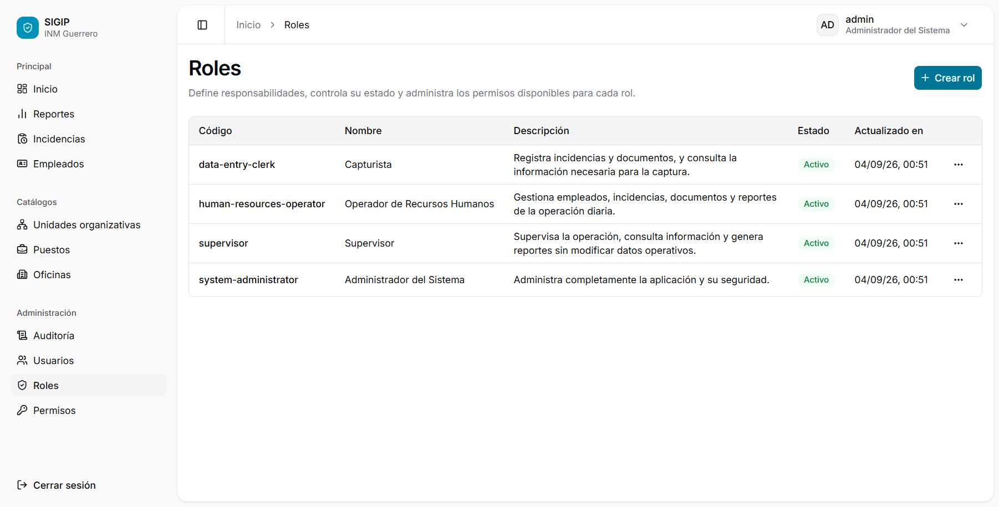
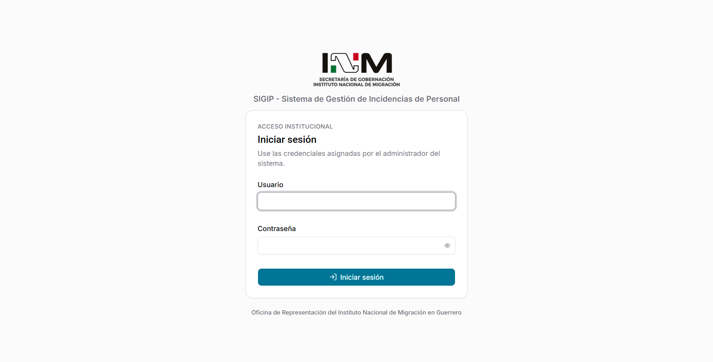
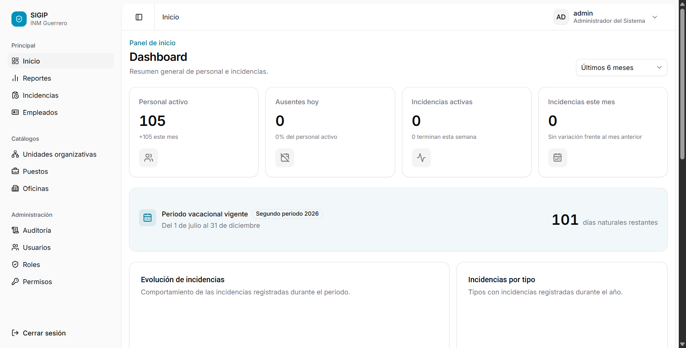
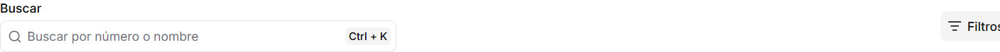
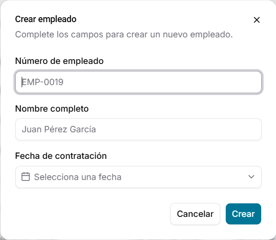
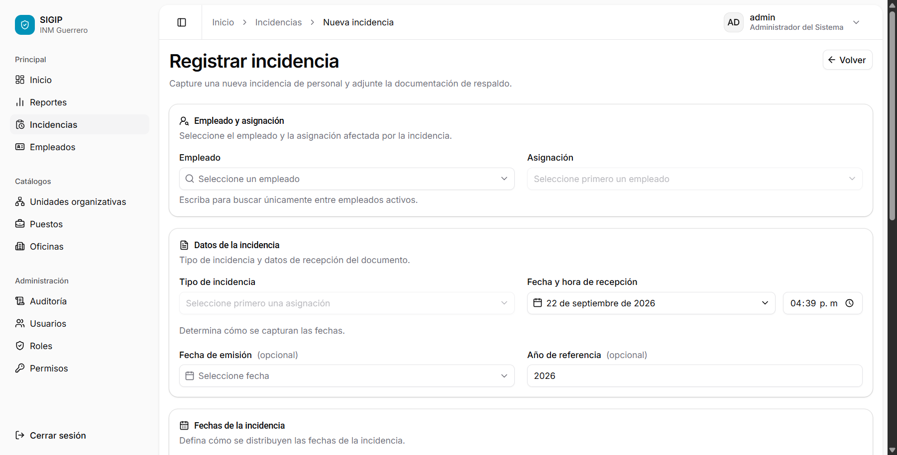
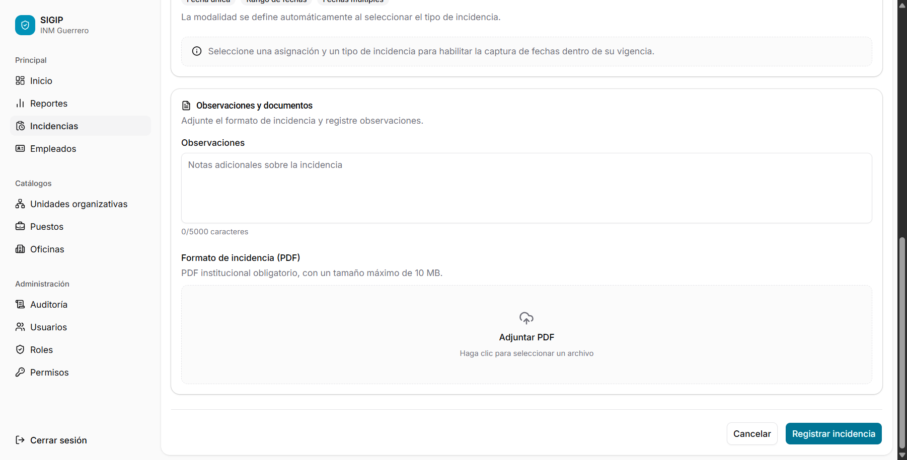
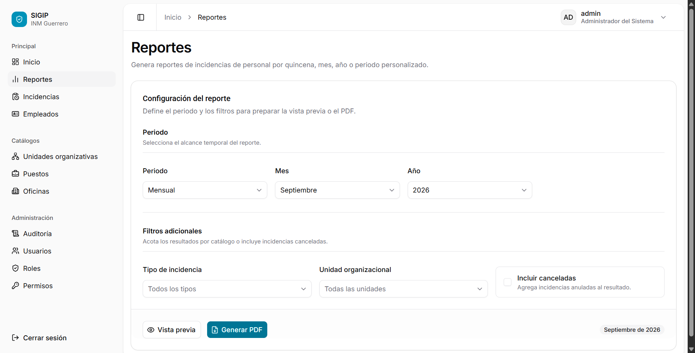
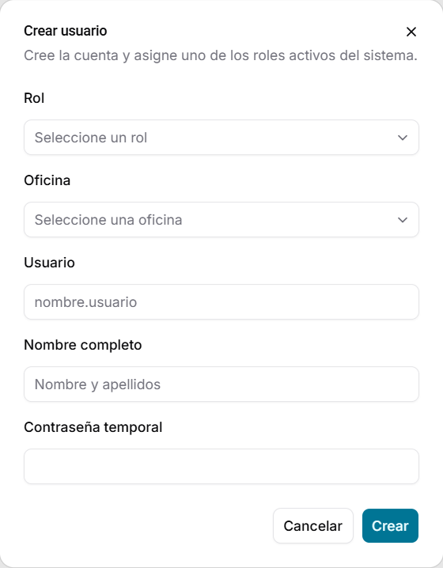

# Manual de usuario de SIGIP

## Sistema de Gestión de Incidencias de Personal

| Control | Información |
|---|---|
| Institución | Oficina de Representación del Instituto Nacional de Migración en Guerrero |
| Versión del manual | 1.0 |
| Fecha de actualización | 22 de septiembre de 2026 |
| Dirigido a | Administradores, supervisores, operadores de Recursos Humanos y capturistas |

---

## Contenido

1. [Presentación](#1-presentación)
2. [Perfiles de usuario](#2-perfiles-de-usuario)
3. [Acceso y navegación](#3-acceso-y-navegación)
4. [Inicio](#4-inicio)
5. [Empleados](#5-empleados)
6. [Incidencias](#6-incidencias)
7. [Documentos de una incidencia](#7-documentos-de-una-incidencia)
8. [Reportes](#8-reportes)
9. [Catálogos](#9-catálogos)
10. [Auditoría](#10-auditoría)
11. [Administración de usuarios](#11-administración-de-usuarios)
12. [Roles y permisos](#12-roles-y-permisos)
13. [Guía rápida por perfil](#13-guía-rápida-por-perfil)
14. [Mensajes y solución de problemas](#14-mensajes-y-solución-de-problemas)
15. [Buenas prácticas](#15-buenas-prácticas)
16. [Glosario](#16-glosario)
17. [Funciones previstas para versiones posteriores](#17-funciones-previstas-para-versiones-posteriores)

---

## 1. Presentación

SIGIP es el sistema interno para registrar, consultar y dar seguimiento a las incidencias del personal de la Oficina de Representación del Instituto Nacional de Migración en Guerrero.

El sistema permite:

- consultar el estado operativo del personal;
- administrar empleados y sus asignaciones;
- registrar incidencias y las fechas en que se aplican;
- resguardar el formato PDF de cada incidencia;
- controlar vacaciones ordinarias y justificaciones de entrada o salida;
- consultar y exportar reportes;
- revisar la trazabilidad de operaciones autorizadas;
- administrar usuarios, sesiones, roles y permisos.

### 1.1 Regla principal

Cada formato institucional representa **una sola incidencia**.

Si una persona presenta conceptos distintos, se debe registrar un formato y una incidencia independiente para cada concepto. Una incidencia puede incluir una fecha, varias fechas independientes o un periodo continuo, siempre que todas correspondan al mismo tipo de incidencia.

SIGIP organiza y resguarda la información digital. Su uso no sustituye los procedimientos institucionales en papel que continúen vigentes.

### 1.2 Alcance del manual

Este manual describe las funciones disponibles en la versión actual de SIGIP. Algunas opciones sólo aparecen cuando el rol del usuario cuenta con el permiso correspondiente.

> **Importante:** si una opción descrita no aparece en su pantalla, esto normalmente significa que su perfil no tiene autorización para utilizarla. No intente acceder mediante una dirección escrita manualmente; el sistema también valida los permisos al abrir cada pantalla.

### 1.3 Alcance por oficina

Cada usuario está adscrito a una oficina. Salvo que tenga autorización para consultar todas las oficinas, SIGIP limita la información operativa de empleados, incidencias, documentos, Inicio, reportes y usuarios a la oficina asignada a su cuenta.

En la configuración inicial:

- el **Administrador del Sistema** puede consultar información de todas las oficinas;
- el **Supervisor**, el **Operador de Recursos Humanos** y el **Capturista** trabajan con la información de su propia oficina.

---

## 2. Perfiles de usuario

SIGIP incluye cuatro perfiles base. Los permisos pueden ser ajustados por un administrador, por lo que la autorización efectiva de una cuenta siempre prevalece sobre esta descripción general.

### 2.1 Administrador del Sistema

Administra completamente la aplicación y su seguridad. Puede realizar las operaciones de los demás perfiles y, además, gestionar usuarios, sesiones, roles, permisos, catálogos y estados de empleados.

### 2.2 Supervisor

Supervisa la operación sin modificar los datos operativos. Puede consultar empleados, incidencias, documentos, paneles, auditoría y reportes, así como exportar reportes en PDF.

### 2.3 Operador de Recursos Humanos

Gestiona la operación diaria. Puede crear y editar empleados, asignaciones e incidencias; cancelar incidencias; cargar documentos; consultar el panel y generar reportes. No administra usuarios, seguridad ni catálogos.

### 2.4 Capturista

Registra incidencias y documentos, y consulta la información necesaria para realizar la captura. No puede editar o cancelar una incidencia ya registrada, modificar empleados ni generar reportes.

### 2.5 Matriz general de funciones

| Función | Administrador | Supervisor | Operador RH | Capturista |
|---|:---:|:---:|:---:|:---:|
| Consultar Inicio | Sí | Sí | Sí | Sí |
| Consultar empleados | Sí | Sí | Sí | Sí |
| Crear empleados | Sí | No | Sí | No |
| Editar empleados y asignaciones | Sí | No | Sí | No |
| Activar o desactivar empleados | Sí | No | No | No |
| Consultar incidencias y documentos | Sí | Sí | Sí | Sí |
| Registrar incidencias | Sí | No | Sí | Sí |
| Editar o cancelar incidencias | Sí | No | Sí | No |
| Cargar documentos permitidos | Sí | No | Sí | Sí |
| Consultar y exportar reportes | Sí | Sí | Sí | No |
| Consultar catálogos | Sí | Sí | Sí | Sí |
| Administrar unidades y puestos | Sí | No | No | No |
| Consultar auditoría | Sí | Sí | No | No |
| Administrar usuarios y sesiones | Sí | No | No | No |
| Administrar roles y permisos | Sí | No | No | No |
| Consultar todas las oficinas | Sí | No | No | No |

_Figura 1. Perfiles base configurados en SIGIP. Las acciones disponibles dependen de los permisos del rol._

---

## 3. Acceso y navegación

### 3.1 Iniciar sesión

1. Abra SIGIP en la dirección proporcionada por el área responsable.
2. Escriba su **Usuario**.
3. Escriba su **Contraseña**.
4. Seleccione **Iniciar sesión**.
5. Espere la confirmación de acceso.

El usuario es obligatorio y admite hasta 50 caracteres. La contraseña también es obligatoria.

Si las credenciales son correctas, SIGIP abre la pantalla solicitada o la primera sección disponible para su perfil.

_Figura 2. Pantalla de acceso institucional con los campos Usuario y Contraseña._

### 3.2 Menú principal

El menú lateral puede contener las siguientes secciones:

| Grupo | Opciones posibles |
|---|---|
| Principal | Inicio, Reportes, Incidencias, Empleados |
| Catálogos | Unidades organizativas, Puestos, Oficinas |
| Administración | Auditoría, Usuarios, Roles, Permisos |

SIGIP muestra únicamente las opciones autorizadas para la cuenta activa.

En pantallas pequeñas, abra el menú lateral, seleccione la opción requerida y el menú se cerrará automáticamente.

### 3.3 Búsquedas, filtros y paginación

En los listados encontrará uno o más de estos controles:

- campo de búsqueda;
- filtros por estado, tipo, unidad o fecha;
- botón **Limpiar** para retirar filtros;
- selector de registros por página;
- botones para avanzar o retroceder entre páginas;
- menú de acciones al final de cada fila.

En las búsquedas que muestran el atajo `Ctrl + K`, puede usar esa combinación para colocar el cursor en el campo de búsqueda.

### 3.4 Cerrar sesión

1. Vaya a la parte inferior del menú lateral.
2. Seleccione **Cerrar sesión**.
3. Espere a que aparezca la pantalla de acceso.

Si existe un error de conexión, SIGIP le informará si la sesión continúa activa. No cierre solamente la pestaña cuando termine de trabajar; utilice siempre **Cerrar sesión**, especialmente en equipos compartidos.

### 3.5 Sesión vencida o revocada

Por seguridad, una sesión puede terminar por inactividad, por alcanzar su duración máxima, por un cambio de contraseña, por la desactivación de la cuenta o porque un administrador la revocó.

Cuando esto ocurra:

1. regrese a la pantalla de inicio de sesión;
2. vuelva a ingresar sus credenciales;
3. si el acceso continúa bloqueado, contacte al Administrador del Sistema.

---

## 4. Inicio

**Disponible para:** todos los perfiles base.

La pantalla **Inicio** presenta un resumen de la operación autorizada para el usuario.

_Figura 3. Panel de inicio del Administrador. Otros perfiles verán únicamente las opciones autorizadas._

### 4.1 Indicadores principales

- **Personal activo:** cantidad de empleados activos.
- **Ausentes hoy:** personal con una incidencia aplicable al día actual.
- **Incidencias activas:** el número principal indica las activas hoy y el texto complementario señala cuántas terminan durante la semana.
- **Incidencias este mes:** total mensual y variación respecto al mes anterior.

### 4.2 Información complementaria

- periodo vacacional institucional vigente;
- evolución de incidencias;
- distribución de incidencias por tipo;
- personal ausente hoy;
- próximas reincorporaciones;
- incidencias registradas recientemente.

### 4.3 Cambiar el periodo de la tendencia

1. Localice el selector de periodo en la parte superior.
2. Elija **Últimos 3 meses**, **Últimos 6 meses**, **Este año** o **Últimos 12 meses**.
3. Espere a que se actualice la gráfica de evolución.

### 4.4 Abrir información relacionada

- Seleccione el nombre de una persona ausente para abrir la incidencia relacionada.
- Seleccione una próxima reincorporación para consultar su incidencia.
- Use **Ver incidencias** o **Ver todas** para abrir el listado general.

---

## 5. Empleados

- **Consulta:** todos los perfiles base.
- **Alta y edición:** Administrador y Operador de Recursos Humanos.
- **Activación y desactivación:** Administrador.

### 5.1 Consultar empleados

1. Abra **Empleados**.
2. Busque por número o nombre, o utilice los filtros disponibles.
3. Si es necesario, filtre por estado, puesto o unidad organizacional.
4. Seleccione el criterio y la dirección de ordenamiento.
5. Abra el menú de acciones de una fila y seleccione **Ver detalles**.

El listado muestra número, nombre completo, fecha de contratación, oficina, estado y última actualización.

_Figura 4. Controles de búsqueda y filtros del listado de empleados._

### 5.2 Crear un empleado

**Perfiles:** Administrador y Operador de Recursos Humanos.

1. En **Empleados**, seleccione **Crear empleado**.
2. Capture el **Número de empleado**.
3. Capture el **Nombre completo**.
4. Registre la **Fecha de contratación** si está disponible.
5. Revise la información y guarde.

Reglas principales:

- número de empleado obligatorio, máximo 50 caracteres;
- nombre completo obligatorio, máximo 200 caracteres;
- fecha de contratación opcional, pero debe ser válida.

_Figura 5. Formulario de alta de empleado. Los campos obligatorios se validan antes de guardar._

### 5.3 Editar un empleado

**Perfiles:** Administrador y Operador de Recursos Humanos.

1. Abra el menú de acciones del empleado.
2. Seleccione **Editar**.
3. Actualice los datos generales.
4. Guarde los cambios.

### 5.4 Activar o desactivar un empleado

**Perfil:** Administrador.

1. Abra el menú de acciones del empleado.
2. Seleccione **Activar** o **Desactivar**, según su estado actual.
3. Revise el mensaje de confirmación.
4. Confirme la operación.

La desactivación no elimina el expediente histórico.

### 5.5 Expediente institucional

El detalle del empleado reúne:

- datos generales y estado;
- fecha de contratación;
- asignación actual;
- control vacacional;
- control de justificaciones;
- historial de asignaciones;
- asignaciones futuras.

### 5.6 Crear una asignación

**Perfiles:** Administrador y Operador de Recursos Humanos.

El empleado debe estar activo.

1. Abra el expediente del empleado.
2. Vaya a **Historial y próximas asignaciones**.
3. Seleccione **Nueva asignación**.
4. Elija una unidad organizativa o **Sin unidad asignada**.
5. Seleccione el puesto.
6. Seleccione el nombramiento **Base** o **Confianza**.
7. Capture horario, fecha de inicio, fecha final opcional y notas.
8. Guarde la asignación.

Reglas principales:

- el puesto y la fecha de inicio son obligatorios;
- la fecha final, cuando exista, no puede ser anterior al inicio;
- el horario admite hasta 150 caracteres;
- las notas admiten hasta 5,000 caracteres;
- al crear se muestran únicamente unidades y puestos activos.

### 5.7 Editar una asignación

1. Abra el expediente del empleado.
2. Localice la asignación actual, futura o histórica.
3. Seleccione la acción de edición.
4. Modifique los datos permitidos.
5. Guarde los cambios.

### 5.8 Control vacacional

El expediente presenta por año y periodo:

- derecho total;
- días consumidos por incidencias;
- ajustes manuales;
- días restantes;
- estado del periodo;
- fecha desde la que el empleado cumple la antigüedad requerida.

Los estados posibles son **Sin derecho todavía**, **Próximo**, **Disponible** y **Vencido**.

#### Registrar un ajuste vacacional

**Perfiles:** Administrador y Operador de Recursos Humanos.

1. En **Control vacacional**, seleccione **Registrar ajuste**.
2. Indique el año.
3. Seleccione el primer o segundo periodo.
4. Capture los días de ajuste.
5. Explique el motivo.
6. Guarde el movimiento.

Use valores positivos para agregar consumo previo y negativos para corregirlo. El ajuste debe ser un entero distinto de cero entre -10 y 10. El motivo debe tener entre 3 y 500 caracteres.

> Los ajustes son movimientos históricos y no se eliminan. Revise cuidadosamente periodo, cantidad y motivo antes de guardar.

### 5.9 Control de justificaciones

Las justificaciones de entrada y salida comparten un máximo de **tres registros activos por empleado y mes**. El expediente muestra cuántos corresponden a entrada, cuántos a salida y cuántos quedan disponibles.

La cancelación de una incidencia libera el espacio que consumía en el límite mensual.

---

## 6. Incidencias

- **Consulta:** todos los perfiles base.
- **Registro:** Administrador, Operador de Recursos Humanos y Capturista.
- **Edición y cancelación:** Administrador y Operador de Recursos Humanos.

### 6.1 Consultar incidencias

1. Abra **Incidencias**.
2. Busque por empleado, número o tipo.
3. Si es necesario, filtre por estado, tipo, adscripción o intervalo de fechas.
4. Seleccione **Limpiar** para retirar todos los filtros.
5. Abra el menú de una fila y seleccione **Ver expediente**.

El listado muestra empleado, número, tipo, clave, fechas de aplicación, estado y fecha de recepción.

Los estados principales son:

- **Registrada:** la incidencia permanece vigente en el sistema;
- **Cancelada:** la incidencia conserva su historial, pero deja de aplicarse.

### 6.2 Registrar una incidencia

**Perfiles:** Administrador, Operador de Recursos Humanos y Capturista.

Antes de comenzar, tenga disponible el formato institucional en PDF y confirme que corresponde a un solo concepto.

1. Abra **Incidencias**.
2. Seleccione **Registrar incidencia**.
3. Busque y seleccione un empleado activo.
4. Seleccione la asignación aplicable.
5. Seleccione el tipo de incidencia.
6. Capture la fecha y hora de recepción.
7. Si corresponde, capture la fecha de emisión y el año de referencia.
8. Registre las fechas de aplicación según la modalidad mostrada.
9. Capture observaciones cuando sean necesarias.
10. Adjunte el formato institucional en PDF.
11. Si se trata de una comisión, adjunte el oficio de comisión cuando esté disponible.
12. Revise todos los datos.
13. Seleccione **Registrar incidencia**.
14. Espere la confirmación y la apertura del expediente.

El tipo de incidencia se habilita después de seleccionar la información laboral requerida.

_Figura 6. Inicio del formulario: selección del empleado, asignación y datos de recepción._

### 6.3 Modalidades de fechas

El tipo de incidencia determina una de estas modalidades:

- **Fecha única:** registre exactamente un día.
- **Fechas múltiples:** agregue cada día independiente.
- **Rango de fechas:** capture fecha inicial y final.

Reglas generales:

- debe existir al menos una fecha;
- no se permiten fechas repetidas;
- la fecha final no puede ser anterior a la inicial;
- las fechas deben corresponder a la vigencia de la asignación seleccionada;
- no se permiten incidencias incompatibles o superpuestas;
- el máximo general es de 366 fechas por incidencia.

### 6.4 Vacaciones ordinarias

Para vacaciones ordinarias puede agregar días individuales o generar los días desde un rango.

- De manera predeterminada se excluyen sábados y domingos.
- Active la opción correspondiente sólo cuando deba incluir fines de semana.
- Cada periodo concede hasta 10 días.
- El derecho se habilita después de cumplir la antigüedad configurada.
- No se permiten fechas vacacionales duplicadas entre incidencias activas.
- Una incidencia cancelada deja de consumir saldo.

Antes de registrar, consulte el **Control vacacional** del empleado.

### 6.5 Formato y archivos

El formato principal:

- es obligatorio al crear la incidencia;
- debe ser un archivo PDF;
- puede tener hasta 10 MB.

Para una incidencia de comisión, el oficio:

- es opcional;
- debe ser PDF;
- puede tener hasta 5 MB.

_Figura 7. Tramo final del formulario con fechas, observaciones y carga del formato PDF._

### 6.6 Otros límites de captura

- Año de referencia: entre 2000 y 2100.
- Observaciones: máximo 5,000 caracteres.
- Justificación de entrada y salida: máximo combinado de tres registros activos por empleado y mes.

### 6.7 Consultar el expediente de una incidencia

1. Abra **Incidencias**.
2. Localice el registro.
3. Abra su menú de acciones.
4. Seleccione **Ver expediente**.

El expediente puede mostrar:

- folio, tipo y estado;
- empleado y número;
- adscripción, puesto, nombramiento y horario;
- vigencia de la asignación;
- clave y modalidad temporal;
- recepción, emisión y año de referencia;
- fechas afectadas;
- observaciones;
- documentos;
- información de cancelación, cuando exista.

### 6.8 Editar una incidencia

**Perfiles:** Administrador y Operador de Recursos Humanos.

La incidencia debe conservar el estado **Registrada**.

1. Abra el menú de acciones de la incidencia o su expediente.
2. Seleccione **Editar**.
3. Actualice los datos permitidos.
4. Revise las fechas y las reglas del tipo de incidencia.
5. Guarde los cambios.

Durante la edición, el empleado y su asignación permanecen bloqueados. Una incidencia cancelada no puede modificarse.

### 6.9 Cancelar una incidencia

**Perfiles:** Administrador y Operador de Recursos Humanos.

1. Abra el menú de acciones de una incidencia registrada.
2. Seleccione **Cancelar incidencia**.
3. Escriba el motivo de cancelación.
4. Revise la advertencia.
5. Confirme con **Cancelar incidencia**.

El motivo debe tener entre 3 y 2,000 caracteres.

La cancelación no borra el registro. SIGIP conserva las fechas, documentos, motivo e historial. En vacaciones y justificaciones, la cancelación libera el saldo o cupo que consumía la incidencia.

---

## 7. Documentos de una incidencia

- **Consulta:** todos los perfiles base.
- **Carga permitida:** Administrador, Operador de Recursos Humanos y Capturista.

### 7.1 Consultar un documento

1. Abra el expediente de la incidencia.
2. Localice **Documentos adjuntos**.
3. Revise nombre, tipo y tamaño del archivo.
4. Seleccione **Visualizar** para abrirlo o utilice la acción de descarga.

Los documentos son privados y requieren una sesión autorizada.

### 7.2 Agregar un oficio de comisión

La opción aparece únicamente cuando la incidencia:

- tiene estado **Registrada**;
- corresponde al tipo **Comisión**;
- todavía no cuenta con un oficio de comisión;
- y el usuario tiene permiso para cargar documentos.

Pasos:

1. Abra el expediente de la comisión.
2. En **Documentos adjuntos**, seleccione **Agregar oficio**.
3. Elija un PDF de hasta 5 MB.
4. Confirme la carga.
5. Espere el mensaje **Oficio de comisión agregado**.

### 7.3 Funciones aún no disponibles en pantalla

La versión actual no ofrece al usuario:

- eliminación de documentos desde la interfaz;
- anexos opcionales distintos del oficio de comisión y el formato principal;
- administración visual de tipos documentales.

---

## 8. Reportes

**Perfiles:** Administrador, Supervisor y Operador de Recursos Humanos.

### 8.1 Tipos de periodo

- **Quincenal:** primera quincena, días 1 al 15; segunda quincena, día 16 al fin de mes.
- **Mensual:** un mes y año.
- **Anual:** un año completo.
- **Personalizado:** fecha inicial y final, con una extensión máxima de un año.

### 8.2 Generar una vista previa

1. Abra **Reportes**.
2. Seleccione el tipo de periodo.
3. Complete quincena, mes y año, o las fechas personalizadas.
4. Si lo requiere, filtre por tipo de incidencia.
5. Si lo requiere, filtre por unidad organizacional.
6. Active **Incluir canceladas** sólo cuando deban formar parte del reporte.
7. Seleccione **Vista previa**.
8. Revise el resumen y el detalle.

_Figura 8. Configuración del periodo, filtros, vista previa y generación del PDF._

La vista previa presenta:

- total de incidencias;
- trabajadores involucrados;
- promedio de incidencias por trabajador;
- distribución por tipo;
- distribución por unidad, cuando aplica;
- detalle de empleado, unidad, tipo, periodo y estado.

### 8.3 Descargar el PDF

1. Configure y revise los filtros.
2. Seleccione **Generar PDF**.
3. Espere mientras el sistema prepara el documento.
4. Confirme que el archivo se descargó correctamente.

Si el botón no aparece, la cuenta no tiene permiso de exportación.

### 8.4 Consideraciones

- En un periodo personalizado, ambas fechas son obligatorias.
- La fecha inicial no puede ser posterior a la final.
- El periodo personalizado no puede superar un año.
- De forma predeterminada, las incidencias canceladas no se incluyen.
- Los reportes respetan el alcance de oficina de la cuenta.

---

## 9. Catálogos

### 9.1 Unidades organizativas

- **Consulta:** todos los perfiles base.
- **Administración:** Administrador.

El listado muestra código, nombre, descripción, estado y última actualización.

#### Crear una unidad

1. Abra **Unidades organizativas**.
2. Seleccione **Crear unidad organizativa**.
3. Capture código, nombre y descripción.
4. Guarde.

Límites:

- código: 3 a 50 caracteres;
- nombre: 3 a 150 caracteres;
- descripción: máximo 355 caracteres.

#### Editar una unidad

1. Abra el menú de acciones.
2. Seleccione **Editar**.
3. Modifique nombre, descripción u orden de clasificación.
4. Guarde.

El código no puede modificarse. El orden debe ser un entero entre 0 y 1,000,000.

El Administrador también puede activar o desactivar unidades desde el menú de acciones.

### 9.2 Puestos

- **Consulta:** todos los perfiles base.
- **Administración:** Administrador.

El listado muestra código, nombre, descripción, estado y última actualización.

Para crear:

1. Abra **Puestos**.
2. Seleccione **Crear puesto**.
3. Capture código, nombre y descripción.
4. Guarde.

Para editar, abra el menú de acciones, seleccione **Editar**, actualice nombre o descripción y guarde.

Límites:

- código: 3 a 50 caracteres;
- nombre: 3 a 150 caracteres;
- descripción: máximo 355 caracteres.

El código no puede modificarse después de crear el puesto. El Administrador también puede activar o desactivar registros.

### 9.3 Oficinas

**Consulta:** todos los perfiles base.

1. Abra **Oficinas**.
2. Localice la oficina requerida.
3. Seleccione la acción de detalle.

El detalle muestra nombre, código, estado, municipio, domicilio, descripción y fechas de registro y actualización.

La pantalla actual es sólo de consulta; no permite crear, editar, activar ni desactivar oficinas.

---

## 10. Auditoría

**Perfiles:** Administrador y Supervisor.

La auditoría permite consultar la trazabilidad de las operaciones que SIGIP ya registra.

> **Alcance especial:** a diferencia de los módulos operativos, la pantalla de Auditoría actualmente no limita los eventos por oficina. El Administrador y el Supervisor con acceso a esta sección pueden consultar eventos de otras oficinas. Esta información es confidencial y sólo debe utilizarse para fines institucionales autorizados.

Actualmente se registran eventos de autenticación, sesiones, usuarios, tipos de incidencia, incidencias, ajustes vacacionales y documentos. Las operaciones generales de empleados, asignaciones, unidades organizativas, puestos, roles y permisos todavía pueden no producir eventos de auditoría.

La ausencia de un evento no demuestra por sí sola que una operación no ocurrió. Si necesita confirmar una acción no cubierta, utilice también el expediente correspondiente y los mecanismos administrativos autorizados.

### 10.1 Consultar eventos

1. Abra **Auditoría**.
2. Filtre por identificador de entidad, acción, tipo de entidad o fechas.
3. Localice el evento.
4. Seleccione la acción de detalle.

El listado muestra fecha, acción, entidad y actor.

_Figura 9. Controles de búsqueda y filtros del historial de auditoría._

### 10.2 Detalle de un evento

El detalle puede incluir:

- acción y entidad;
- nombre del actor y usuario;
- fecha y hora;
- identificador de entidad;
- identificador de sesión;
- dirección IP;
- dispositivo o navegador;
- valores anteriores;
- valores nuevos.

La auditoría es de consulta. Los eventos no se editan ni se eliminan desde SIGIP.

---

## 11. Administración de usuarios

**Perfil:** Administrador.

### 11.1 Consultar usuarios

1. Abra **Usuarios**.
2. Revise nombre, usuario, rol, oficina, estado y último acceso.
3. Use la paginación para recorrer el listado.
4. Abra el menú de acciones para consultar o administrar una cuenta.

### 11.2 Crear un usuario

1. Seleccione **Crear usuario**.
2. Elija un rol activo.
3. Seleccione una oficina activa.
4. Capture el nombre de usuario.
5. Capture el nombre completo.
6. Asigne una contraseña temporal.
7. Guarde y entregue las credenciales mediante un medio seguro.

Reglas:

- usuario: 3 a 50 caracteres;
- sólo letras, números, punto, guion y guion bajo;
- SIGIP convierte el usuario a minúsculas;
- nombre completo: máximo 150 caracteres;
- contraseña temporal: 8 a 255 caracteres.

_Figura 10. Alta de una cuenta con rol, oficina y contraseña temporal._

### 11.3 Editar un usuario

1. Abra el menú de acciones.
2. Seleccione **Editar**.
3. Actualice rol, oficina, usuario o nombre completo.
4. Guarde.

Un usuario sólo puede tener un rol activo a la vez.

### 11.4 Restablecer contraseña

1. Abra el menú de acciones del usuario activo.
2. Seleccione **Cambiar contraseña**.
3. Capture la nueva contraseña.
4. Confírmela.
5. Guarde.

Ambos valores deben coincidir y tener entre 8 y 255 caracteres. El cambio de contraseña revoca las sesiones activas del usuario.

### 11.5 Activar o desactivar una cuenta

1. Abra el menú de acciones.
2. Seleccione **Activar** o **Desactivar**.
3. Confirme la operación.

No se permite desactivar desde esa acción la misma cuenta con la que se está operando. Al desactivar un usuario se revocan sus sesiones activas.

### 11.6 Consultar y revocar sesiones

1. Abra el menú de acciones del usuario.
2. Seleccione **Ver sesiones**.
3. Revise dispositivo, navegador, IP, inicio, última actividad, vencimientos y estado.
4. En una sesión activa distinta de la actual, seleccione **Revocar sesión**.
5. Confirme la revocación.

La pantalla administrativa muestra sesiones creadas durante los últimos siete días. La sesión actual no puede revocarse desde este diálogo; para terminarla utilice **Cerrar sesión**.

---

## 12. Roles y permisos

**Perfil:** Administrador.

### 12.1 Consultar roles

1. Abra **Roles**.
2. Revise código, nombre, descripción, estado y última actualización.
3. Abra el menú de acciones para editar, cambiar estado o administrar permisos.

### 12.2 Crear un rol

1. Seleccione **Crear rol**.
2. Capture un código único.
3. Capture nombre y descripción.
4. Guarde.
5. Abra **Administrar permisos** en el menú del nuevo rol.
6. Seleccione los permisos necesarios.
7. Guarde los permisos.

Límites:

- código: 3 a 50 caracteres;
- nombre: 3 a 100 caracteres;
- descripción: máximo 355 caracteres.

El código no puede modificarse después de crear el rol. Un rol inactivo no permite cambiar permisos hasta que sea reactivado.

### 12.3 Activar o desactivar un rol

Un rol con usuarios asignados no puede desactivarse. Antes debe cambiarse el rol de esas cuentas o definir el procedimiento administrativo correspondiente.

### 12.4 Catálogo de permisos

La pantalla **Permisos** muestra código, descripción y fecha de creación. En la versión actual es de consulta: permite abrir el detalle, pero no crear, editar ni eliminar permisos desde la interfaz.

### 12.5 Recomendaciones de seguridad

- Asigne el rol de menor privilegio que permita realizar el trabajo.
- No convierta a todos los usuarios en administradores.
- Revise el alcance de oficina antes de entregar una cuenta.
- Después de cambiar permisos, solicite al usuario actualizar la pantalla.
- Desactive cuentas que ya no deban ingresar.
- Revise y revoque sesiones sospechosas.

---

## 13. Guía rápida por perfil

### 13.1 Administrador del Sistema

Prioridades habituales:

1. Crear la cuenta y asignar oficina y rol.
2. Mantener unidades organizativas y puestos activos.
3. Dar soporte a empleados, asignaciones e incidencias.
4. Restablecer contraseñas y revocar sesiones cuando sea necesario.
5. Consultar auditoría ante dudas sobre una operación.
6. Revisar periódicamente roles y permisos.

Puede realizar todas las tareas operativas descritas en este manual, salvo las funciones señaladas como aún no disponibles en la interfaz.

### 13.2 Supervisor

Recorrido recomendado:

1. Consulte **Inicio** para revisar el estado diario.
2. Use **Empleados** e **Incidencias** para verificar expedientes sin modificarlos.
3. Abra **Reportes**, configure el periodo y revise la vista previa.
4. Exporte el PDF cuando necesite presentar información.
5. Use **Auditoría** para confirmar actores, fechas y cambios registrados.

El Supervisor no debe esperar botones de alta, edición o cancelación.

### 13.3 Operador de Recursos Humanos

Recorrido recomendado:

1. Verifique o cree el empleado.
2. Confirme que tenga una asignación vigente.
3. Revise vacaciones o justificaciones cuando el tipo lo requiera.
4. Registre la incidencia y adjunte el formato PDF.
5. Abra el expediente y confirme fechas y documentos.
6. Corrija mediante edición sólo mientras la incidencia esté registrada.
7. Cancele con un motivo claro cuando proceda.
8. Genere reportes para el seguimiento operativo.

No puede activar o desactivar empleados ni administrar usuarios, seguridad o catálogos con el perfil base.

### 13.4 Capturista

Recorrido recomendado:

1. Busque al empleado y consulte su expediente.
2. Verifique asignación, saldo o límite aplicable.
3. Abra **Incidencias** y seleccione **Registrar incidencia**.
4. Capture cuidadosamente el tipo, recepción y fechas.
5. Adjunte el formato PDF correcto.
6. Revise toda la información antes de guardar.
7. Consulte el expediente creado para confirmar el registro.

> El Capturista no puede editar ni cancelar después de guardar. Si detecta un error, debe informar al Operador de Recursos Humanos o al Administrador e indicar el folio de la incidencia.

---

## 14. Mensajes y solución de problemas

### 14.1 La opción no aparece en el menú

**Causa probable:** la cuenta no tiene el permiso requerido.

**Acción:** confirme con el Administrador del Sistema que el rol asignado sea correcto. No se trata necesariamente de una falla.

### 14.2 Acceso denegado

**Causa probable:** intentó abrir una dirección sin el permiso correspondiente o el rol cambió.

**Acción:** regrese al menú y use únicamente las opciones visibles. Si necesita esa función para su trabajo, solicite una revisión de permisos.

### 14.3 No aparecen empleados o incidencias esperados

**Causas posibles:**

- existen filtros activos;
- está consultando otra página del listado;
- el registro pertenece a una oficina fuera de su alcance;
- el registro no cumple el estado seleccionado.

**Acción:** seleccione **Limpiar**, revise la oficina de su cuenta y vuelva a buscar.

### 14.4 No se puede seleccionar el tipo de incidencia

**Causa probable:** falta seleccionar el empleado o la asignación requerida.

**Acción:** complete primero el contexto laboral del empleado.

### 14.5 El archivo es rechazado

Compruebe que:

- sea PDF;
- el formato principal no exceda 10 MB;
- el oficio de comisión no exceda 5 MB;
- el archivo no esté dañado;
- la conexión permanezca activa.

### 14.6 Una fecha no es aceptada

Revise que:

- esté dentro de la vigencia de la asignación;
- no esté repetida;
- no se superponga con otra incidencia incompatible;
- exista saldo o cupo disponible;
- la fecha final no sea anterior a la inicial.

### 14.7 No aparece Editar o Cancelar

La cuenta puede no tener permiso o la incidencia puede estar cancelada. El Capturista y el Supervisor no cuentan con estas acciones en sus perfiles base.

### 14.8 El reporte no se genera

Revise el periodo y los filtros. Para un periodo personalizado, capture ambas fechas, mantenga el orden correcto y no exceda un año. Si sólo falta el botón PDF, la cuenta puede tener consulta sin permiso de exportación.

### 14.9 La sesión terminó inesperadamente

Vuelva a iniciar sesión. Si ocurre repetidamente, informe al Administrador e indique la hora aproximada y la pantalla en la que trabajaba.

### 14.10 Información para solicitar soporte

Proporcione únicamente:

- nombre de usuario, nunca la contraseña;
- fecha y hora aproximada;
- pantalla o módulo;
- acción realizada;
- mensaje mostrado;
- folio o número de empleado relacionado, cuando aplique;
- captura de pantalla sin información sensible innecesaria.

---

## 15. Buenas prácticas

### Para todos los usuarios

- No comparta su usuario ni contraseña.
- Revise nombres, fechas, tipo de incidencia y archivos antes de guardar.
- Use los filtros antes de concluir que falta información.
- Descargue documentos sólo cuando sea necesario para su función.
- Cierre sesión al terminar.
- No deje una sesión abierta en equipos compartidos.
- Reporte accesos o movimientos que no reconozca.

### Para quienes capturan incidencias

- Confirme que el formato corresponde al empleado seleccionado.
- Registre un concepto por incidencia.
- Compruebe que la asignación cubra todas las fechas.
- Revise saldo vacacional y límite de justificaciones.
- Use observaciones claras y objetivas.
- Verifique que el PDF sea legible antes de adjuntarlo.

### Para administradores

- Mantenga una cuenta por persona.
- Asigne el perfil mínimo necesario.
- Evite usar cuentas genéricas.
- Desactive cuentas que ya no se utilicen.
- Revise sesiones y auditoría ante cualquier incidente de seguridad.
- No modifique roles o catálogos sin conocer el impacto operativo.

---

## 16. Glosario

| Término | Significado |
|---|---|
| Adscripción | Unidad organizacional asociada a la asignación del empleado. |
| Asignación | Relación laboral vigente o histórica que reúne puesto, unidad, nombramiento, horario y fechas. |
| Auditoría | Registro de quién realizó una operación, cuándo la realizó y qué valores cambiaron. |
| Catálogo | Conjunto controlado de opciones, como puestos o unidades organizativas. |
| Incidencia | Registro digital de un concepto de personal y de las fechas en que se aplica. |
| Ocurrencia | Cada fecha individual incluida dentro de una incidencia. |
| Perfil o rol | Conjunto de permisos asignado a una cuenta. |
| Permiso | Autorización específica para consultar o ejecutar una acción. |
| Sesión | Acceso activo iniciado con usuario y contraseña. |
| Folio | Identificador visible de una incidencia. |
| Expediente | Vista que reúne la información relacionada con un empleado o una incidencia. |

---

## 17. Funciones previstas para versiones posteriores

Para evitar confusiones, las siguientes funciones no forman parte de la interfaz actual:

- administración visual de tipos de incidencia;
- administración visual de tipos documentales;
- carga de anexos distintos del formato principal y del oficio de comisión;
- eliminación de documentos desde la interfaz;
- edición de oficinas;
- creación, edición o eliminación de permisos desde la pantalla de permisos.

Este manual debe actualizarse cuando alguna de estas funciones sea habilitada o cuando cambien los perfiles y permisos institucionales.
