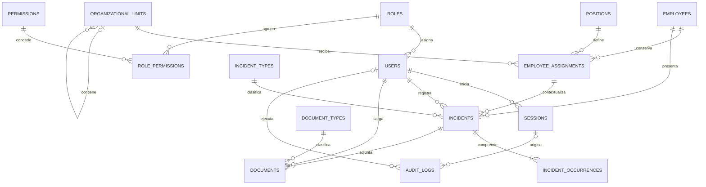

# Esquema propuesto de base de datos

> Estado: propuesta de diseño. Este documento no implica que la base de datos, el ORM o las migraciones ya estén implementados.

## 1. Objetivo

Este esquema traduce el dominio actual de SIGIP (Sistema de Gestión de Incidencias de Personal) a un modelo relacional que pueda implementarse posteriormente con MySQL y Drizzle ORM.

El diseño busca cubrir:

- usuarios, roles, permisos y sesiones revocables;
- empleados y su historial de adscripción, puesto y nombramiento;
- incidencias asociadas a un único concepto institucional;
- incidencias de fecha única, varias fechas o periodos;
- formatos y anexos almacenados de manera privada;
- cancelaciones sin pérdida del historial;
- auditoría de operaciones relevantes.

## 2. Alcance y supuestos

- Motor previsto: MySQL 8 o superior.
- ORM previsto: Drizzle ORM.
- Los nombres físicos se expresan en `snake_case`; los modelos TypeScript pueden exponer `camelCase`.
- Todas las entidades usan UUIDv7 generado por la aplicación. MySQL lo almacena como `BINARY(16)` y la API lo representa como una cadena UUID canónica.
- Las fechas administrativas sin hora usan `DATE`.
- Los eventos del sistema usan `DATETIME(6)` en UTC.
- La conexión a MySQL debe operar en UTC. Se propone que MySQL asigne `created_at` con `CURRENT_TIMESTAMP(6)` y que la aplicación actualice explícitamente `updated_at`; no se dependerá de comportamientos `ON UPDATE` diferentes entre tablas.
- Los archivos no se guardan como BLOB: la base conserva metadatos y una ruta privada de almacenamiento.
- Los usuarios se autentican únicamente con `username` y contraseña. No se almacena correo electrónico porque el sistema es cerrado y no existe un flujo que lo requiera.
- Los catálogos y registros con valor histórico se desactivan o cancelan; no se eliminan físicamente.
- Los valores de estado se documentan como `VARCHAR` controlados por la aplicación y restricciones `CHECK`, evitando acoplar el modelo a `ENUM` de MySQL.

### 2.1 Estrategia de identificadores

- UUIDv7 combina aleatoriedad criptográfica con orden temporal, reduciendo la fragmentación de índices frente a UUIDv4.
- La aplicación genera el UUID antes del `INSERT`, lo que permite relacionar registros dentro de una misma transacción sin depender de `AUTO_INCREMENT`.
- `BINARY(16)` ocupa 16 bytes, frente a los 36 caracteres de un UUID textual. La conversión entre bytes y texto pertenece a la capa de persistencia.
- Los UUIDv7 deben codificarse en su orden binario natural; no se debe aplicar el intercambio de bytes pensado por MySQL para UUIDv1.
- Los modelos y DTO exponen los identificadores como `string` y deben validar el formato UUID recibido.
- Un UUID dificulta enumerar registros, pero no es un mecanismo de autorización. Toda consulta debe seguir comprobando permisos y alcance de acceso.
- UUIDv7 revela aproximadamente el momento de generación. En este sistema no se considera información sensible y además existe `created_at`; si ese supuesto cambia, se deberá reevaluar UUIDv4.

## 3. Diagrama entidad-relación



Cada usuario tiene exactamente un rol activo mediante `users.role_id`. Un rol puede estar asignado a muchos usuarios. Cambiar el rol de un usuario reemplaza esa referencia y el cambio se conserva en `audit_logs`; no se acumulan roles ni se utiliza una tabla puente.

## 4. Tablas

### 4.1 Acceso y autorización

#### `users`

Usuarios que pueden acceder al sistema. La contraseña nunca se almacena en texto plano.

| Columna | Tipo | Nulo | Restricciones / propósito |
| --- | --- | --- | --- |
| `id` | `BINARY(16)` | No | PK UUIDv7 generado por la aplicación |
| `role_id` | `BINARY(16)` | No | FK a `roles.id`; rol actual y único del usuario |
| `username` | `VARCHAR(50)` | No | Único; 3 a 50 caracteres; letras, números, `.`, `_` y `-` |
| `full_name` | `VARCHAR(150)` | No | Nombre mostrado en el sistema |
| `password_hash` | `VARCHAR(255)` | No | Hash producido por el algoritmo de autenticación elegido |
| `is_active` | `BOOLEAN` | No | `TRUE` por defecto |
| `last_login_at` | `DATETIME(6)` | Sí | Último acceso exitoso |
| `created_at` | `DATETIME(6)` | No | Fecha de creación |
| `updated_at` | `DATETIME(6)` | No | Última modificación |

#### `roles`

| Columna | Tipo | Nulo | Restricciones / propósito |
| --- | --- | --- | --- |
| `id` | `BINARY(16)` | No | PK UUIDv7 generado por la aplicación |
| `code` | `VARCHAR(50)` | No | Código único e inmutable |
| `name` | `VARCHAR(100)` | No | Nombre visible |
| `description` | `VARCHAR(500)` | Sí | Descripción funcional |
| `is_active` | `BOOLEAN` | No | `TRUE` por defecto |
| `created_at` | `DATETIME(6)` | No | Fecha de creación |
| `updated_at` | `DATETIME(6)` | No | Última modificación |

Roles iniciales propuestos: `ADMINISTRATOR`, `HR_MANAGER` y `HR_CAPTURE_CLERK`.

#### `permissions`

| Columna | Tipo | Nulo | Restricciones / propósito |
| --- | --- | --- | --- |
| `id` | `BINARY(16)` | No | PK UUIDv7 generado por la aplicación |
| `code` | `VARCHAR(100)` | No | Código único, por ejemplo `incidents:create` |
| `description` | `VARCHAR(500)` | Sí | Acción que habilita |
| `created_at` | `DATETIME(6)` | No | Fecha de creación |

Permisos iniciales previstos:

- `incidents:create`, `incidents:read`, `incidents:update`, `incidents:cancel`;
- `employees:create`, `employees:read`, `employees:update`;
- `documents:create`, `documents:read`;
- `users:manage`, `catalogs:manage`, `audit:read`, `sessions:manage`.

#### `role_permissions`

| Columna | Tipo | Nulo | Restricciones / propósito |
| --- | --- | --- | --- |
| `role_id` | `BINARY(16)` | No | PK parcial, FK a `roles.id` |
| `permission_id` | `BINARY(16)` | No | PK parcial, FK a `permissions.id` |
| `created_at` | `DATETIME(6)` | No | Momento de asignación |

PK compuesta: (`role_id`, `permission_id`).

#### `sessions`

Sesiones de servidor revocables. Solo se persiste el hash del token entregado al cliente.

| Columna | Tipo | Nulo | Restricciones / propósito |
| --- | --- | --- | --- |
| `id` | `BINARY(16)` | No | PK UUIDv7 generado por la aplicación |
| `user_id` | `BINARY(16)` | No | FK a `users.id` |
| `token_hash` | `CHAR(64)` | No | SHA-256 hexadecimal, único |
| `created_at` | `DATETIME(6)` | No | Inicio de sesión |
| `last_activity_at` | `DATETIME(6)` | No | Última actividad válida |
| `idle_expires_at` | `DATETIME(6)` | No | Expiración por inactividad |
| `absolute_expires_at` | `DATETIME(6)` | No | Límite máximo de vida de la sesión |
| `revoked_at` | `DATETIME(6)` | Sí | Fecha de revocación |
| `revoked_by` | `BINARY(16)` | Sí | FK a `users.id`; nulo en cierre propio o expiración |
| `revoked_reason` | `VARCHAR(255)` | Sí | Motivo de revocación |
| `ip_address` | `VARCHAR(45)` | Sí | IPv4 o IPv6 |
| `user_agent` | `VARCHAR(500)` | Sí | Agente del cliente |

Una sesión es válida solo si el usuario continúa activo, `revoked_at IS NULL` y tanto `idle_expires_at` como `absolute_expires_at` son posteriores al momento actual. Cada actividad válida puede extender `idle_expires_at`, pero nunca más allá de `absolute_expires_at`.

### 4.2 Personal y organización

#### `employees`

Mantiene la identidad estable del trabajador. Su contexto laboral variable vive en `employee_assignments`.

| Columna | Tipo | Nulo | Restricciones / propósito |
| --- | --- | --- | --- |
| `id` | `BINARY(16)` | No | PK UUIDv7 generado por la aplicación |
| `employee_number` | `VARCHAR(50)` | No | Número institucional único |
| `full_name` | `VARCHAR(200)` | No | Nombre completo |
| `hire_date` | `DATE` | Sí | Fecha de ingreso, si se conoce |
| `status` | `VARCHAR(30)` | No | Inicialmente `ACTIVE` o `INACTIVE` |
| `created_at` | `DATETIME(6)` | No | Fecha de creación |
| `updated_at` | `DATETIME(6)` | No | Última modificación |

No se agregan CURP, RFC, NSS u otros datos personales porque todavía no forman parte del alcance confirmado.

#### `organizational_units`

Catálogo jerárquico de áreas, departamentos o adscripciones.

| Columna | Tipo | Nulo | Restricciones / propósito |
| --- | --- | --- | --- |
| `id` | `BINARY(16)` | No | PK UUIDv7 generado por la aplicación |
| `parent_id` | `BINARY(16)` | Sí | FK a `organizational_units.id` |
| `code` | `VARCHAR(50)` | No | Código único |
| `name` | `VARCHAR(150)` | No | Nombre de la unidad |
| `description` | `VARCHAR(500)` | Sí | Descripción opcional |
| `is_active` | `BOOLEAN` | No | `TRUE` por defecto |
| `sort_order` | `INT` | No | `0` por defecto |
| `created_at` | `DATETIME(6)` | No | Fecha de creación |
| `updated_at` | `DATETIME(6)` | No | Última modificación |

La aplicación debe impedir ciclos en la jerarquía.

#### `positions`

| Columna | Tipo | Nulo | Restricciones / propósito |
| --- | --- | --- | --- |
| `id` | `BINARY(16)` | No | PK UUIDv7 generado por la aplicación |
| `code` | `VARCHAR(50)` | No | Código único |
| `name` | `VARCHAR(150)` | No | Nombre del puesto o cargo |
| `description` | `VARCHAR(500)` | Sí | Descripción opcional |
| `is_active` | `BOOLEAN` | No | `TRUE` por defecto |
| `created_at` | `DATETIME(6)` | No | Fecha de creación |
| `updated_at` | `DATETIME(6)` | No | Última modificación |

#### `employee_assignments`

Conserva el historial laboral del empleado para que una incidencia siga mostrando el contexto que existía cuando ocurrió.

| Columna | Tipo | Nulo | Restricciones / propósito |
| --- | --- | --- | --- |
| `id` | `BINARY(16)` | No | PK UUIDv7 generado por la aplicación |
| `employee_id` | `BINARY(16)` | No | FK a `employees.id` |
| `organizational_unit_id` | `BINARY(16)` | No | FK a `organizational_units.id` |
| `position_id` | `BINARY(16)` | No | FK a `positions.id` |
| `appointment_type` | `VARCHAR(30)` | No | Inicialmente `BASE` o `CONFIANZA` |
| `schedule` | `VARCHAR(150)` | Sí | Descripción del horario |
| `effective_from` | `DATE` | No | Inicio de vigencia |
| `effective_to` | `DATE` | Sí | Fin inclusivo; nulo si continúa vigente |
| `notes` | `TEXT` | Sí | Observaciones administrativas |
| `created_at` | `DATETIME(6)` | No | Fecha de creación |
| `updated_at` | `DATETIME(6)` | No | Última modificación |

Restricciones:

- `effective_to` debe ser igual o posterior a `effective_from`;
- un empleado no puede tener asignaciones con periodos superpuestos;
- se recomienda `UNIQUE (id, employee_id)` para soportar la integridad compuesta desde `incidents`.

### 4.3 Incidencias

#### `incident_types`

Catálogo institucional de conceptos de incidencia.

| Columna | Tipo | Nulo | Restricciones / propósito |
| --- | --- | --- | --- |
| `id` | `BINARY(16)` | No | PK UUIDv7 generado por la aplicación |
| `code` | `VARCHAR(50)` | No | Código único e inmutable |
| `name` | `VARCHAR(150)` | No | Nombre visible |
| `description` | `TEXT` | Sí | Descripción y criterios de uso |
| `temporal_mode` | `VARCHAR(30)` | No | `SINGLE_DATE`, `MULTIPLE_DATES` o `DATE_RANGE` |
| `appointment_scope` | `VARCHAR(30)` | No | `ALL`, `BASE` o `CONFIANZA` |
| `requires_document` | `BOOLEAN` | No | Indica si exige respaldo documental |
| `is_active` | `BOOLEAN` | No | `TRUE` por defecto |
| `sort_order` | `INT` | No | `0` por defecto |
| `created_at` | `DATETIME(6)` | No | Fecha de creación |
| `updated_at` | `DATETIME(6)` | No | Última modificación |

Si los tipos de nombramiento o los documentos requeridos crecen, `appointment_scope` y `requires_document` deberán sustituirse por relaciones N:M específicas.

#### `incidents`

Una fila representa una incidencia y un único concepto institucional. Dos conceptos diferentes requieren dos incidencias diferentes.

| Columna | Tipo | Nulo | Restricciones / propósito |
| --- | --- | --- | --- |
| `id` | `BINARY(16)` | No | PK UUIDv7 generado por la aplicación |
| `employee_id` | `BINARY(16)` | No | FK a `employees.id` |
| `employee_assignment_id` | `BINARY(16)` | No | FK a `employee_assignments.id` |
| `incident_type_id` | `BINARY(16)` | No | FK a `incident_types.id` |
| `format_date` | `DATE` | Sí | Fecha consignada en el formato |
| `received_at` | `DATETIME(6)` | No | Recepción por Recursos Humanos |
| `observations` | `TEXT` | Sí | Notas de captura |
| `status` | `VARCHAR(30)` | No | `REGISTERED` o `CANCELLED` |
| `registered_by` | `BINARY(16)` | No | FK a `users.id` |
| `updated_by` | `BINARY(16)` | Sí | FK a `users.id` |
| `cancelled_at` | `DATETIME(6)` | Sí | Momento de cancelación |
| `cancelled_by` | `BINARY(16)` | Sí | FK a `users.id` |
| `cancellation_reason` | `TEXT` | Sí | Motivo obligatorio al cancelar |
| `created_at` | `DATETIME(6)` | No | Fecha de creación |
| `updated_at` | `DATETIME(6)` | No | Última modificación |

Integridad recomendada:

- FK compuesta (`employee_assignment_id`, `employee_id`) hacia (`employee_assignments.id`, `employee_assignments.employee_id`) para impedir asignaciones de otro trabajador;
- una incidencia `CANCELLED` debe tener `cancelled_at`, `cancelled_by` y `cancellation_reason`;
- una incidencia `REGISTERED` no debe tener datos de cancelación;
- la asignación debe estar vigente en las fechas de la incidencia;
- quincena, mes, año y duración se derivan de `incident_occurrences`; no se duplican aquí.

#### `incident_occurrences`

Representa la temporalidad sin duplicar la incidencia:

- fecha única: una fila con `end_date = NULL`;
- varias fechas: varias filas con `end_date = NULL`;
- periodo: una fila con `start_date` y `end_date`.

| Columna | Tipo | Nulo | Restricciones / propósito |
| --- | --- | --- | --- |
| `id` | `BINARY(16)` | No | PK UUIDv7 generado por la aplicación |
| `incident_id` | `BINARY(16)` | No | FK a `incidents.id` |
| `start_date` | `DATE` | No | Fecha única o inicio del periodo |
| `end_date` | `DATE` | Sí | Fin inclusivo del periodo |
| `normalized_end_date` | `DATE GENERATED ... STORED` | No | `COALESCE(end_date, start_date)`; uso interno para integridad |
| `created_at` | `DATETIME(6)` | No | Fecha de creación |

Restricciones:

- `end_date` debe ser igual o posterior a `start_date`;
- `normalized_end_date` debe ser una columna generada almacenada y no formar parte del contrato de la API;
- `UNIQUE (incident_id, start_date, normalized_end_date)` evita ocurrencias exactamente duplicadas, incluidas las fechas individuales cuyo `end_date` es nulo;
- toda incidencia debe conservar al menos una ocurrencia;
- la modalidad debe coincidir con `incident_types.temporal_mode`;
- se deben rechazar periodos superpuestos dentro de una misma incidencia.

### 4.4 Documentos

#### `document_types`

| Columna | Tipo | Nulo | Restricciones / propósito |
| --- | --- | --- | --- |
| `id` | `BINARY(16)` | No | PK UUIDv7 generado por la aplicación |
| `code` | `VARCHAR(50)` | No | Código único e inmutable |
| `name` | `VARCHAR(100)` | No | Nombre visible |
| `description` | `VARCHAR(500)` | Sí | Descripción y criterios de uso |
| `is_active` | `BOOLEAN` | No | `TRUE` por defecto |
| `sort_order` | `INT` | No | `0` por defecto |
| `created_at` | `DATETIME(6)` | No | Fecha de creación |
| `updated_at` | `DATETIME(6)` | No | Última modificación |

Valores iniciales propuestos: `FORMATO_INCIDENCIA`, `OFICIO_COMISION`, `CONSTANCIA`, `INCAPACIDAD_JUSTIFICANTE` y `OTRO`.

#### `documents`

| Columna | Tipo | Nulo | Restricciones / propósito |
| --- | --- | --- | --- |
| `id` | `BINARY(16)` | No | PK UUIDv7 generado por la aplicación |
| `incident_id` | `BINARY(16)` | No | FK a `incidents.id` |
| `document_type_id` | `BINARY(16)` | No | FK a `document_types.id` |
| `original_name` | `VARCHAR(255)` | No | Nombre recibido del usuario |
| `stored_name` | `VARCHAR(255)` | No | Nombre interno único |
| `storage_path` | `VARCHAR(1000)` | No | Ruta privada, nunca una URL pública |
| `mime_type` | `VARCHAR(150)` | No | Tipo validado por el servidor |
| `size_bytes` | `BIGINT UNSIGNED` | No | Tamaño del archivo |
| `content_hash` | `CHAR(64)` | Sí | SHA-256 para integridad o detección de duplicados |
| `uploaded_by` | `BINARY(16)` | No | FK a `users.id` |
| `created_at` | `DATETIME(6)` | No | Fecha de carga |
| `deleted_at` | `DATETIME(6)` | Sí | Baja lógica |
| `deleted_by` | `BINARY(16)` | Sí | FK a `users.id` |
| `deletion_reason` | `VARCHAR(500)` | Sí | Motivo de baja |

`stored_name` o `storage_path` debe ser único. La descarga siempre debe pasar por autenticación y autorización del backend.

### 4.5 Auditoría

#### `audit_logs`

Bitácora append-only: la aplicación puede insertar registros, pero no editarlos ni eliminarlos durante la operación normal.

| Columna | Tipo | Nulo | Restricciones / propósito |
| --- | --- | --- | --- |
| `id` | `BINARY(16)` | No | PK UUIDv7 generado por la aplicación |
| `user_id` | `BINARY(16)` | Sí | FK a `users.id`; nulo para eventos sin usuario autenticado |
| `session_id` | `BINARY(16)` | Sí | FK a `sessions.id`; identifica la sesión que originó la acción |
| `action` | `VARCHAR(100)` | No | Acción, por ejemplo `INCIDENT_CANCELLED` |
| `entity_type` | `VARCHAR(100)` | No | Tipo lógico de entidad |
| `entity_id` | `BINARY(16)` | Sí | UUID de la entidad; sin FK por ser una relación polimórfica |
| `old_values` | `JSON` | Sí | Estado anterior sanitizado |
| `new_values` | `JSON` | Sí | Estado posterior sanitizado |
| `ip_address` | `VARCHAR(45)` | Sí | IPv4 o IPv6 |
| `user_agent` | `VARCHAR(500)` | Sí | Agente del cliente |
| `created_at` | `DATETIME(6)` | No | Momento del evento |

No deben registrarse contraseñas, tokens, hashes de sesión ni contenido binario en `old_values` o `new_values`.

Eventos mínimos que deben auditarse:

- inicio de sesión correcto y fallido, cierre y revocación de sesiones;
- creación, modificación, desactivación y cambio de contraseña de usuarios;
- cambios de roles y permisos;
- alta, modificación y cambio de estado de empleados y asignaciones;
- creación, modificación y cancelación de incidencias;
- carga y baja lógica de documentos;
- modificaciones de catálogos institucionales.

Los campos de actor directo, como `registered_by`, se reservan para hechos del dominio que deban consultarse sin reconstruir la bitácora. `audit_logs` conserva el historial detallado de cambios. Antes de implementar se debe aplicar esta convención de manera uniforme a las altas, modificaciones y cambios de estado.

## 5. Relaciones y políticas de borrado

| Relación | Cardinalidad | Política recomendada |
| --- | --- | --- |
| rol - usuario | 1:N | `RESTRICT`; cada usuario debe conservar exactamente un rol y los roles se desactivan en lugar de eliminarse |
| rol - permiso | N:M | `RESTRICT` |
| usuario - sesión | 1:N | `RESTRICT`; revocar sesiones, no borrar usuario |
| sesión - auditoría | 1:N | `RESTRICT`; conservar la sesión mientras exista auditoría asociada |
| empleado - asignación | 1:N | `RESTRICT` |
| unidad - asignación | 1:N | `RESTRICT`; desactivar catálogo |
| puesto - asignación | 1:N | `RESTRICT`; desactivar catálogo |
| empleado - incidencia | 1:N | `RESTRICT` |
| asignación - incidencia | 1:N | `RESTRICT` |
| tipo - incidencia | 1:N | `RESTRICT`; desactivar catálogo |
| incidencia - ocurrencia | 1:N obligatorio | `CASCADE` solo durante una creación fallida; en operación normal no borrar |
| incidencia - documento | 1:N | `RESTRICT`; usar baja lógica |
| usuario - auditoría | 1:N | `SET NULL` únicamente si se llegara a permitir borrado físico |

La regla general es conservar las referencias históricas. Un `CASCADE DELETE` amplio podría destruir evidencia administrativa y no debe utilizarse.

## 6. Índices recomendados

Además de PK, FK y restricciones únicas:

```text
users                  UNIQUE (username)
users                  INDEX (role_id, is_active)
employees              UNIQUE (employee_number)
roles                  UNIQUE (code)
permissions            UNIQUE (code)
organizational_units   UNIQUE (code), INDEX (parent_id)
positions              UNIQUE (code)
incident_types         UNIQUE (code)
document_types         UNIQUE (code)

sessions               UNIQUE (token_hash)
sessions               INDEX (user_id, revoked_at, absolute_expires_at)
sessions               INDEX (idle_expires_at)
sessions               INDEX (absolute_expires_at)

employee_assignments   INDEX (employee_id, effective_from, effective_to)
employee_assignments   INDEX (organizational_unit_id, effective_from, effective_to)

incidents              INDEX (employee_id, status)
incidents              INDEX (incident_type_id, status)
incidents              INDEX (employee_assignment_id)
incidents              INDEX (status, received_at)
incidents              INDEX (registered_by, created_at)

incident_occurrences   UNIQUE (incident_id, start_date, normalized_end_date)
incident_occurrences   INDEX (incident_id)
incident_occurrences   INDEX (start_date, end_date)

documents              UNIQUE (storage_path)
documents              INDEX (incident_id, deleted_at)
documents              INDEX (document_type_id)
documents              INDEX (uploaded_by, created_at)

audit_logs             INDEX (entity_type, entity_id)
audit_logs             INDEX (user_id, created_at)
audit_logs             INDEX (session_id, created_at)
audit_logs             INDEX (created_at)
```

Los índices definitivos deben validarse con consultas reales y `EXPLAIN`; no conviene crear índices adicionales sin observar el patrón de uso.

## 7. Reglas transaccionales

Estas reglas no quedan resueltas únicamente con llaves foráneas y deben implementarse dentro de casos de uso transaccionales:

1. Crear una incidencia junto con todas sus ocurrencias; nunca dejar una incidencia sin ocurrencias.
2. Comprobar que la asignación pertenece al empleado y está vigente para todas las fechas capturadas.
3. Validar la modalidad temporal y el nombramiento contra el tipo de incidencia.
4. Impedir asignaciones laborales y ocurrencias incompatibles o superpuestas.
5. Exigir el documento correspondiente cuando `requires_document` sea verdadero.
6. Cancelar sin borrar, guardando usuario, fecha y motivo en la misma transacción.
7. Revocar todas las sesiones activas al desactivar un usuario.
8. Cambiar el rol de un usuario actualizando `users.role_id`; nunca agregar un segundo rol. La operación debe registrar el rol anterior y el nuevo en auditoría.
9. Solo se puede asignar un rol activo. Un rol con usuarios asignados no puede desactivarse hasta que esos usuarios sean migrados a otro rol activo.
10. Al registrar actividad de una sesión, extender `idle_expires_at` sin superar `absolute_expires_at`.
11. Guardar la auditoría en la misma transacción que la operación auditada cuando sea posible.

## 8. Datos derivados

No se recomienda persistir los siguientes valores porque se calculan a partir de las ocurrencias y relaciones existentes:

- quincena;
- mes y año de la incidencia;
- duración de un periodo;
- vigencia actual de una asignación;
- estado efectivo de una sesión (`active`, `idle_expired`, `absolute_expired` o `revoked`);
- conteos y métricas del dashboard.

Si las consultas agregadas se vuelven costosas, primero se deben medir y después valorar vistas, tablas de resumen o procesos de proyección.

## 9. Decisiones pendientes antes de implementar

1. Definir el catálogo real de tipos de incidencia y sus reglas.
2. Confirmar los estados válidos de empleados e incidencias; por ahora se propone el mínimo necesario. Definir también si la inactivación de un empleado exige fecha, motivo y usuario responsable.
3. Confirmar si un tipo puede admitir más de una modalidad temporal.
4. Definir si `format_date` corresponde a elaboración, firma o autorización.
5. Definir la regla institucional de quincena, especialmente para periodos que cruzan quincenas.
6. Confirmar todos los tipos de nombramiento además de Base y Confianza.
7. Confirmar si debe existir exactamente un `FORMATO_INCIDENCIA` activo por incidencia, qué anexos exige cada tipo y cuándo una incidencia se considera completa. También se debe resolver el flujo entre la transacción de MySQL y la carga no transaccional del archivo, ya sea mediante compensación o un estado pendiente. Si las reglas varían por tipo, sustituir `requires_document` por una relación de requisitos documentales.
8. Confirmar si el formato tiene folio o número institucional, si es obligatorio y el alcance de su unicidad antes de agregar `format_number`.
9. Definir MIME permitidos, tamaño máximo, análisis antivirus, retención y respaldo de archivos.
10. Definir los plazos de expiración absoluta e inactividad de sesiones y el algoritmo de hash de contraseñas.
11. Definir la política de credenciales: cambio obligatorio inicial, fecha del último cambio, bloqueo por intentos fallidos, desbloqueo y revocación de sesiones después de cambiar contraseña.
12. Definir retención, consulta y protección de la bitácora de auditoría, incluida su relación con sesiones antiguas.
13. Confirmar la normalización y sensibilidad a mayúsculas del nombre de usuario.
14. Definir si una incidencia cancelada puede reactivarse o si debe crearse una incidencia de reemplazo.
15. Confirmar si `full_name` es suficiente o si la fuente oficial requiere separar nombres y apellidos.
16. Definir qué entidades necesitan `created_by`, `updated_by` o campos de cambio de estado además de la bitácora general.
17. Unificar los códigos definitivos de roles antes de crear seeds; actualmente existen variantes como `ADMINISTRATOR`/`ADMIN` y `HR_CAPTURE_CLERK`/`HR_CLERK` en los documentos de diseño.

## 10. Orden sugerido de implementación futura

1. Configuración de MySQL, Drizzle y convenciones compartidas.
2. `roles`, `permissions`, `role_permissions`, `users` y `sessions`.
3. Catálogos de organización y personal con `employee_assignments`.
4. Catálogo y núcleo de incidencias con sus ocurrencias.
5. Tipos y metadatos de documentos, junto con almacenamiento privado.
6. Auditoría transversal.
7. Seeds de catálogos, restricciones e índices finales.
8. Pruebas de integración para reglas temporales, cancelación, permisos y concurrencia.
